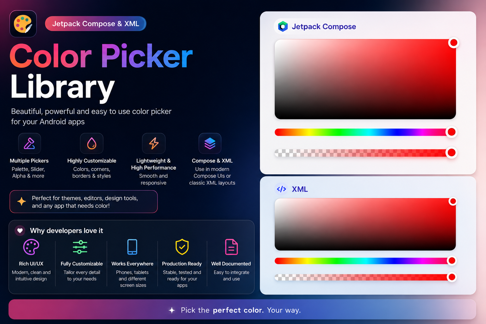

# 🎨 ColorPickerView
[](https://jitpack.io/#mihphu/ColorPickerView)

# 🎬 Preview


# 🚀 Features
- **ColorPicker** — pick saturation and value (brightness) on a 2D plane in the HSV color model
- **HueSlider** — pick the hue and feed it into the ColorPicker
- **ColorAlphaSlider** — pick the alpha of the color coming from the ColorPicker, over a transparency checkerboard
- State survives configuration changes (screen rotation and so on)
- Size changes are handled correctly, so animations and layout changes look right
- The three components work together or entirely on their own
- Every value can also be set from code
- Available for **both XML layouts and Jetpack Compose**, as two independent artifacts

| Artifact | UI toolkit | minSdk | Pulls in Compose |
|---|---|---|---|
| `colorpickerview` | XML / Android Views | 18 | no |
| `colorpickerview-compose` | Jetpack Compose | 21 | yes |

The two artifacts share no code — pick one, or use both in the same app.

# 🏄‍♂️ Gradle dependency

`settings.gradle`
```gradle
dependencyResolutionManagement {
    ..
    repositories {
        maven { url 'https://jitpack.io' }
    }
}
```

> **Note:** The coordinates below are the expected form for a multi-module JitPack build
> (`com.github.<owner>.<repo>:<module>:<tag>`). They have not yet been confirmed against an
> actual JitPack build log for the `1.1.1` tag — check
> https://jitpack.io/#mihphu/ColorPickerView/1.1.1 and use whatever the log prints if it differs.

`build.gradle`
```gradle
// XML views — minSdk 18, does not pull in Compose
implementation("com.github.mihphu.ColorPickerView:colorpickerview:1.1.1")

// Jetpack Compose — minSdk 21
implementation("com.github.mihphu.ColorPickerView:colorpickerview-compose:1.1.1")
```

---

# 📦 XML usage

## Layout

The three views are `ColorPicker`, `HueSlider` and `ColorAlphaSlider`. Every attribute below is
optional — omit it and the default applies.

```xml
<com.happytech.colorpickerview.ColorPicker
    android:id="@+id/colorPickerView"
    android:layout_width="match_parent"
    android:layout_height="200dp"
    app:cpv_pickerBorderRadius="8dp"
    app:cpv_pickerOutlineColor="#0D000000"
    app:cpv_pickerOutlineSize="1dp"
    app:cpv_thumbOutlineColor="#E6E6E6"
    app:cpv_thumbOutlineSize="1dp"
    app:cpv_thumbStrokeColor="@color/white"
    app:cpv_thumbStrokeSize="4dp" />

<com.happytech.colorpickerview.HueSlider
    android:id="@+id/hueSlider"
    android:layout_width="match_parent"
    android:layout_height="wrap_content"
    app:sliderBarStrokeCap="Round"
    app:cpv_thumbOutlineColor="#E6E6E6"
    app:cpv_thumbOutlineSize="1dp"
    app:cpv_thumbStrokeColor="@color/white"
    app:cpv_thumbStrokeSize="4dp" />

<com.happytech.colorpickerview.ColorAlphaSlider
    android:id="@+id/colorAlphaSlider"
    android:layout_width="match_parent"
    android:layout_height="wrap_content"
    app:cpv_showAlphaChecker="true"
    app:cpv_alphaCheckerRows="3"
    app:cpv_thumbOutlineColor="#E6E6E6"
    app:cpv_thumbOutlineSize="1dp"
    app:cpv_thumbStrokeColor="@color/white"
    app:cpv_thumbStrokeSize="4dp" />
```

`wrap_content` on a slider resolves to **48dp**, of which the bar itself takes the middle 12dp.

## Connecting the views

The `ColorPicker` drives the other two. Assign them to it and they stay in sync:

```kotlin
val colorPicker = findViewById<ColorPicker>(R.id.colorPickerView)
val hueSlider = findViewById<HueSlider>(R.id.hueSlider)
val colorAlphaSlider = findViewById<ColorAlphaSlider>(R.id.colorAlphaSlider)

colorPicker.hueSliderView = hueSlider
colorPicker.alphaSliderView = colorAlphaSlider
```

## Reading the selected color

```kotlin
// Kotlin
colorPicker.color
// Java
colorPicker.getColor();
```

The returned color includes alpha when a `ColorAlphaSlider` is attached.

## Setting the color

```kotlin
colorPicker.color = Color.parseColor("#962626")
colorPicker.color = Color.argb(128, 255, 255, 255)
```

**Order matters.** Assigning `color` propagates to the attached sliders, so attach them *first*:

```kotlin
// The sliders follow the new color
colorPicker.hueSliderView = hueSlider
colorPicker.alphaSliderView = alphaSlider
colorPicker.color = Color.argb(128, 255, 255, 255)

// The sliders keep their old positions
colorPicker.color = Color.argb(128, 255, 255, 255)
colorPicker.hueSliderView = hueSlider
colorPicker.alphaSliderView = alphaSlider
```

## Listeners

Each component reports continuously while dragging, and once more when the finger lifts.

```kotlin
// ColorPicker
colorPicker.setOnColorChangedListener { color -> }
colorPicker.setOnColorChangeEndListener { color -> }

// HueSlider — hue is [0..360], argbColor is that hue at full saturation and brightness
hueSlider.setOnHueChangedListener { hue, argbColor -> }
hueSlider.setOnHueChangeEndListener { hue, argbColor -> }

// ColorAlphaSlider — alpha is [0..1]
colorAlphaSlider.setOnAlphaChangedListener { alpha -> }
colorAlphaSlider.setOnAlphaChangeEndListener { alpha -> }
```

Java callers can pass the corresponding interface instead of a lambda:
`OnColorChangedListener`, `OnColorChangeEndListener`, `OnHueChangedListener`,
`OnHueChangeEndListener`, `OnAlphaChangedListener`, `OnAlphaChangeEndListener`.

## 🌈 All XML attributes

| Attribute | Type | Default | Applies to | Description |
|---|---|---|---|---|
| `cpv_pickerBorderRadius` | `dimension` | `2dp` — see note | `ColorPicker` | Corner radius of the color plane. |
| `cpv_pickerOutlineSize` | `dimension` | `1dp` | `ColorPicker` | Thickness of the hairline border around the color plane. |
| `cpv_pickerOutlineColor` | `color` | `#E6E6E6` | `ColorPicker` | Color of that hairline border. |
| `cpv_thumbOutlineSize` | `dimension` | `1dp` | all three | Thickness of the thumb's outermost ring. |
| `cpv_thumbOutlineColor` | `color` | `#FFFFFFFF` | all three | Color of the thumb's outermost ring. |
| `cpv_thumbStrokeSize` | `dimension` | `2dp` | all three | Thickness of the thumb's inner stroke ring. |
| `cpv_thumbStrokeColor` | `color` | `#FFFFFFFF` | all three | Color of the thumb's inner stroke ring. |
| `cpv_showAlphaChecker` | `boolean` | `true` | `ColorAlphaSlider` | Whether the transparency checkerboard is drawn under the alpha gradient. |
| `cpv_alphaCheckerRows` | `integer` | `3` | `ColorAlphaSlider` | How many checkerboard squares fit across the bar's thickness. Cell size is derived from it, so a higher number means smaller squares. Values below 1 are clamped to 1. |
| `sliderBarStrokeCap` | `enum` | `Round` | `HueSlider`, `ColorAlphaSlider` | End shape of the bar: `Butt` (0), `Round` (1), `Square` (2). Note this attribute has no `cpv_` prefix. |

> **Note on `cpv_pickerBorderRadius`:** its declared property default is `8dp`, but the value used
> when the attribute is absent is `2dp` — the attribute is read with the *thumb stroke size* as its
> fallback, before that stroke size has itself been read. Set the attribute explicitly if you care
> about the corner radius.

The thumb is drawn as four concentric circles: outline ring, stroke ring, a 10%-darkened rim, then
the color itself. `cpv_thumbOutlineSize` and `cpv_thumbStrokeSize` are measured inward from the
outer edge, so their sum must stay below the thumb radius.

## 💻 Setting attributes from code

Every attribute has a matching property. **Sizes are in pixels, not dp** — convert if you are
working from dp values.

```kotlin
// ColorPicker only
picker.pickerBorderRadius = 8f * resources.displayMetrics.density
picker.pickerOutlineSize = 1f * resources.displayMetrics.density
picker.pickerOutlineColor = Color.parseColor("#E6E6E6")
picker.circleIndicatorRadius = 12f * resources.displayMetrics.density  // no XML attribute
picker.hue = 200f                                                      // [0..360]

// Thumb — all three components
view.thumbOutlineSize = 1f * density
view.thumbOutlineColor = Color.WHITE
view.thumbStrokeSize = 2f * density
view.thumbStrokeColor = Color.WHITE

// Sliders only
slider.lineStrokeCap = Paint.Cap.ROUND

// HueSlider
hueSlider.hue = 200f            // [0..360]

// ColorAlphaSlider
alphaSlider.selectedColor = Color.RED   // the color the gradient fades to
alphaSlider.alphaValue = 0.5f           // [0..1]
alphaSlider.showAlphaChecker = true
alphaSlider.alphaCheckerRows = 3
```

`circleIndicatorRadius` is the `ColorPicker`'s thumb radius. It is settable only from code — there
is no XML attribute for it. The two sliders derive their thumb radius from the bar thickness
instead.

The checkerboard colors (`#FFFFFF` and `#D7D7E1`) are fixed in the XML version. The Compose
version lets you change them.

---

# 🧩 Jetpack Compose usage

The `colorpickerview-compose` artifact is a native rewrite on Compose `Canvas`. It shares no code
with the XML artifact and does not depend on it.

## Quick start

```kotlin
@Composable
fun ColorPickerScreen() {
    val state = rememberColorPickerState(Color.Red)

    Column(verticalArrangement = Arrangement.spacedBy(8.dp)) {
        ColorPicker(state = state, modifier = Modifier.height(240.dp))
        HueSlider(state = state)
        ColorAlphaSlider(state = state)
    }

    // state.color is the currently selected color, including alpha
}
```

One `ColorPickerState` shared by all three composables replaces the
`hueSliderView` / `alphaSliderView` assignment of the XML version. `rememberColorPickerState` is
backed by `rememberSaveable`, so the selection survives screen rotation.

`ColorPicker` has **no default height** — give it one through `modifier`. The two sliders default
to 48dp tall.

## `ColorPickerState`

```kotlin
val state = rememberColorPickerState(initialColor = Color.Red)

state.hue          // var Float, [0..360]
state.saturation   // var Float, [0..1]
state.value        // var Float, [0..1]
state.alpha        // var Float, [0..1]
state.color        // var Color — reads as HSV + alpha; writing it splits back into the four above
```

Every setter clamps into range rather than throwing, because setters run during recomposition.

Assigning an achromatic color — white, black or any grey — keeps the hue already selected, since
such a color carries no hue of its own. Setting `state.color = Color.White` therefore leaves the
hue slider where the user put it instead of swinging it round to red.

`initialColor` seeds the state on first composition only; later changes to it are ignored, the same
way `rememberScrollState` treats its initial value. To push a new color into an existing state,
assign `state.color`.

## Managing state yourself

Each composable has a stateless overload taking a value plus a callback:

```kotlin
var hue by remember { mutableFloatStateOf(30f) }
HueSlider(hue = hue, onHueChange = { hue = it })

var saturation by remember { mutableFloatStateOf(1f) }
var value by remember { mutableFloatStateOf(1f) }
ColorPicker(
    hue = hue,
    saturation = saturation,
    value = value,
    onChange = { s, v -> saturation = s; value = v },
    modifier = Modifier.height(240.dp),
)

var alpha by remember { mutableFloatStateOf(1f) }
ColorAlphaSlider(
    color = Color.hsv(hue, saturation, value),
    alpha = alpha,
    onAlphaChange = { alpha = it },
)
```

The state-based overloads are thin wrappers that delegate straight to these, so the two paths
cannot drift apart.

## Parameters

**Shared by all three**

| Parameter | Type | Default | Description |
|---|---|---|---|
| `modifier` | `Modifier` | `Modifier` | Standard modifier. `ColorPicker` needs a height here. |
| `colors` | `ColorPickerColors` | `ColorPickerDefaults.colors()` | Thumb, outline and checkerboard colors. |
| `thumb` | `ThumbStyle` | `ColorPickerDefaults.thumb()` | Thumb radius and ring thicknesses. |

**`ColorPicker`**

| Parameter | Type | Default | Description |
|---|---|---|---|
| `state` | `ColorPickerState` | — | State-based overload. |
| `hue` / `saturation` / `value` | `Float` | — | Stateless overload. `hue` is input only; this composable does not change it. |
| `onChange` | `(saturation: Float, value: Float) -> Unit` | — | Stateless overload. Fires continuously while dragging. |
| `cornerRadius` | `Dp` | `8.dp` | Corner radius of the color plane. |
| `outlineWidth` | `Dp` | `1.dp` | Thickness of the hairline border. |
| `onColorChangeFinished` | `((Color) -> Unit)?` | `null` | Fires once when the finger lifts. |

**`HueSlider`**

| Parameter | Type | Default | Description |
|---|---|---|---|
| `state` | `ColorPickerState` | — | State-based overload. |
| `hue` | `Float` | — | Stateless overload, `[0..360]`. |
| `onHueChange` | `(Float) -> Unit` | — | Stateless overload. Fires continuously while dragging. |
| `trackThickness` | `Dp` | `12.dp` | Thickness of the bar. Independent of the thumb radius. |
| `onHueChangeFinished` | `((Float) -> Unit)?` | `null` | Fires once when the finger lifts. |

**`ColorAlphaSlider`**

| Parameter | Type | Default | Description |
|---|---|---|---|
| `state` | `ColorPickerState` | — | State-based overload. |
| `color` | `Color` | — | Stateless overload. The color the gradient fades to; its own alpha is ignored. |
| `alpha` | `Float` | — | Stateless overload, `[0..1]`. |
| `onAlphaChange` | `(Float) -> Unit` | — | Stateless overload. Fires continuously while dragging. |
| `trackThickness` | `Dp` | `12.dp` | Thickness of the bar. Independent of the thumb radius. |
| `showChecker` | `Boolean` | `true` | Whether to draw the transparency checkerboard. |
| `checkerRows` | `Int` | `3` | Squares across the bar's thickness. Cell size is derived from it, so a higher number means smaller squares. Below 1 is clamped to 1. |
| `onAlphaChangeFinished` | `((Float) -> Unit)?` | `null` | Fires once when the finger lifts. |

The thumb radius comes from `thumb` (`ColorPickerDefaults.thumb(radius = ...)`), not from
`trackThickness`. A radius below half the thickness is raised to it so the bar's rounded caps stay
inside the slider, and a radius above 24dp makes the slider taller than its default 48dp instead of
clipping the thumb.

## `ColorPickerDefaults`

```kotlin
ColorPickerDefaults.PickerCornerRadius  // 8.dp
ColorPickerDefaults.PickerOutlineWidth  // 1.dp
ColorPickerDefaults.TrackThickness      // 12.dp
ColorPickerDefaults.SliderHeight        // 48.dp
ColorPickerDefaults.CheckerRows         // 3

ColorPickerDefaults.colors(
    thumbStroke: Color = Color.White,
    thumbOutline: Color = Color.White,
    pickerOutline: Color = Color(0x0D000000),
    checkerLight: Color = Color.White,
    checkerDark: Color = Color(0xFFD7D7E1),
): ColorPickerColors

ColorPickerDefaults.thumb(
    radius: Dp = 12.dp,        // thumb radius, for the picker and both sliders
    strokeSize: Dp = 2.dp,
    outlineSize: Dp = 1.dp,
): ThumbStyle
```

Both are plain functions, not `@Composable`, so they are cheap to call as default arguments.

## Customization

```kotlin
val colors = ColorPickerDefaults.colors(
    thumbOutline = Color(0xFFE6E6E6),
    pickerOutline = Color(0x1A000000),
    checkerDark = Color.LightGray,
)
val thumb = ColorPickerDefaults.thumb(radius = 14.dp, strokeSize = 4.dp)

ColorPicker(
    state = state,
    modifier = Modifier.height(240.dp),
    colors = colors,
    thumb = thumb,
    cornerRadius = 16.dp,
    outlineWidth = 1.dp,
    onColorChangeFinished = { color -> save(color) },
)

HueSlider(
    state = state,
    modifier = Modifier.height(56.dp),
    colors = colors,
    thumb = thumb,
    trackThickness = 16.dp,
)

ColorAlphaSlider(
    state = state,
    colors = colors,
    thumb = thumb,
    showChecker = true,
    checkerRows = 4,
    onAlphaChangeFinished = { alpha -> save(alpha) },
)
```

---

# 🔁 XML ↔ Compose reference

| XML | Compose |
|---|---|
| `cpv_pickerBorderRadius` | `ColorPicker(cornerRadius = …)` |
| `cpv_pickerOutlineSize` | `ColorPicker(outlineWidth = …)` |
| `cpv_pickerOutlineColor` | `ColorPickerDefaults.colors(pickerOutline = …)` |
| `cpv_thumbOutlineSize` | `ColorPickerDefaults.thumb(outlineSize = …)` |
| `cpv_thumbOutlineColor` | `ColorPickerDefaults.colors(thumbOutline = …)` |
| `cpv_thumbStrokeSize` | `ColorPickerDefaults.thumb(strokeSize = …)` |
| `cpv_thumbStrokeColor` | `ColorPickerDefaults.colors(thumbStroke = …)` |
| `cpv_showAlphaChecker` | `ColorAlphaSlider(showChecker = …)` |
| `cpv_alphaCheckerRows` | `ColorAlphaSlider(checkerRows = …)` |
| `circleIndicatorRadius` (code only) | `ColorPickerDefaults.thumb(radius = …)` |
| bar thickness (derived from view height) | `trackThickness` — declared directly |
| checkerboard colors (fixed) | `ColorPickerDefaults.colors(checkerLight = …, checkerDark = …)` |
| `sliderBarStrokeCap` | no equivalent — the Compose bar is always a capsule |
| `colorPicker.hueSliderView = …` | one shared `ColorPickerState` |
| `colorPicker.alphaSliderView = …` | one shared `ColorPickerState` |
| `colorPicker.color` | `state.color` |
| `setOnColorChangedListener` | `onChange`, or read `state` |
| `setOnColorChangeEndListener` | `onColorChangeFinished` |

## Differences worth knowing

- **Bar thickness** is declared directly through `trackThickness` in Compose, instead of being
  derived from the view's height as in XML.
- **One `onXxxChangeFinished` callback** replaces the changed/changeEnd listener pair. The
  in-progress value already reaches you through the state or the `onChange` callback.
- **The hue band** is a 7-stop gradient in Compose, rather than the 360px bitmap the XML version
  ships. Not distinguishable by eye, and it keeps a PNG out of the artifact.
- **`ColorPicker` has no default height** in Compose. Pass one through `modifier`.
- **Default outline color differs**: XML uses `#E6E6E6` (opaque), Compose uses `Color(0x0D000000)`
  (5% black). Pass `pickerOutline = Color(0xFFE6E6E6)` if you want them to match exactly.
- **`ColorPicker.onColorChangeFinished` carries alpha only in the state-based overload**, which can
  read it from the shared state. The stateless overload has no alpha to report and hands back an
  opaque color.
- **The two sliders expose `ProgressBarRangeInfo` semantics** for TalkBack. The XML views expose
  none.
- **Checkerboard colors are configurable** in Compose and fixed in XML.

# License
```
MIT License

Copyright (c) 2025 Mohammad Hossein Naderi
https://github.com/Mohammad3125/KavehColorPicker

All modifications and enhancements Copyright (c) 2025
```
